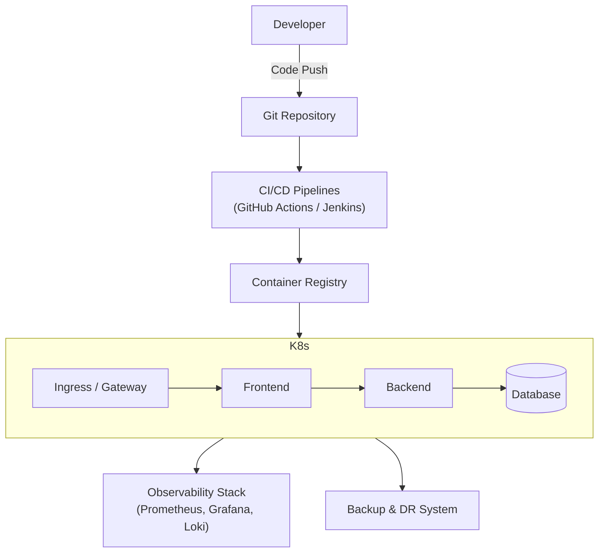
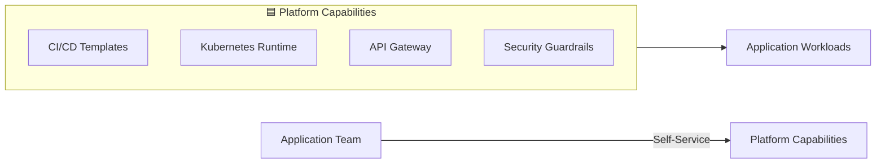
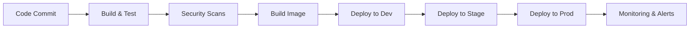
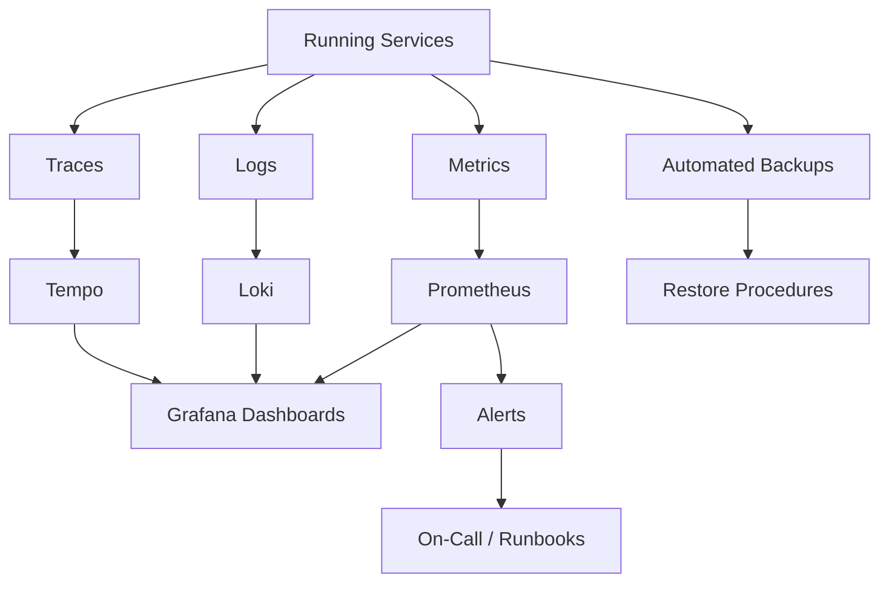
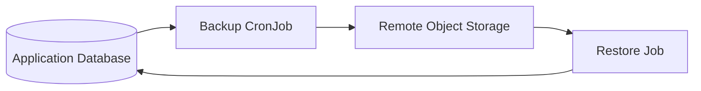

# 🚀 Platform Engineering Lab

An SRE-driven internal developer platform built on Kubernetes, focused on reliability, observability, and secure delivery at scale.

## System Architecture Diagrams

### Deployment Pipeline & Infrastructure

### Internal Developer Platform Model

### Continuous Delivery Pipeline

### Observability Stack

### Backup & Disaster Recovery

---

## 📌 Overview

**platform-engineering-lab** is a production-grade monorepo that demonstrates how a modern Internal Developer Platform (IDP) can be designed and operated with Site Reliability Engineering principles at its core.

### What's Included

This repository brings together:

- **Application Delivery** — Three-tier services with scalable architecture
- **CI/CD Standardization** — GitHub Actions & Jenkins pipelines
- **Platform Infrastructure** — Kubernetes, networking, and API gateway
- **Observability & Reliability** — Comprehensive monitoring and recovery tooling
- **Security & Compliance** — Guardrails and policy enforcement

The goal is to model how platform teams enable developer velocity while preserving production stability.

---

## 🎯 Design Principles

| Principle                  | Description                                                                        |
| -------------------------- | ---------------------------------------------------------------------------------- |
| **Platform as a Product**  | Shared capabilities are opinionated, reusable, and versioned.                      |
| **Reliability by Default** | Backups, observability, and recovery are first-class citizens — not afterthoughts. |
| **Separation of Concerns** | Clear boundaries between application logic, platform services, and SRE controls.   |
| **Everything as Code**     | Infrastructure, pipelines, dashboards, and policies are Git-versioned.             |

---

## 🧩 Repository Structure & Ownership Model

This repository is intentionally organized around responsibility, not tools.

### 🟦 Platform Capabilities

*These folders represent what the platform provides to application teams.*

#### `applications/`

**What it is:** Self-contained three-tier applications (frontend, backend, database)

**Platform responsibility:**
- Define golden paths for application structure
- Standardize deployment and Helm patterns

#### `ci-cd/`

**What it is:** CI/CD tooling and pipelines

- GitHub Actions workflows
- Jenkins pipelines and shared libraries

**Platform responsibility:**
- Provide reusable CI/CD templates
- Enforce consistent build, test, and deploy flows
- Enable safe and repeatable delivery

#### `platform/`

**What it is:** Core shared infrastructure and runtime components

Includes:
- Kubernetes primitives (namespaces, ingress, networking)
- KrakenD API Gateway configuration
- Terraform modules & environment definitions
- Ansible playbooks and roles

**Platform responsibility:**
- Abstract infrastructure complexity
- Provide stable, shared runtime services
- Enable multi-environment parity

#### `security/`

**What it is:** Policy, secrets, and security automation

Includes:
- OPA / Kyverno policies
- Secrets management integrations
- Image and dependency scanning

**Platform responsibility:**
- Enforce security guardrails
- Shift security left without slowing developers

### 🟥 SRE Controls

*These folders represent how reliability is enforced across the platform.*

#### `observability/`

**What it is:** Metrics, logs, dashboards, and alerting

Includes:
- Grafana dashboards
- Prometheus rules
- Loki / Tempo configurations

**SRE responsibility:**
- Make system behavior visible
- Detect issues early
- Enable fast diagnosis

#### `reliability/`

**What it is:** Reliability and resilience tooling

Includes:
- Custom database backup and restore solution
- Disaster recovery scripts and runbooks
- SLOs, SLIs, and error budgets
- Chaos engineering experiments (optional)

**SRE responsibility:**
- Ensure recoverability
- Define and measure reliability targets
- Minimize blast radius during failures

### 🧰 Shared Utilities

#### `docs/`

Architecture diagrams, runbooks, onboarding guides, and standards.

#### `scripts/`

Bootstrap and helper scripts — no business logic.

---

## 🚀 What This Repository Demonstrates

- How Platform Engineering and SRE complement each other
- How reliability can be designed into the platform, not bolted on
- How to scale delivery without sacrificing stability

## 🧠 Intended Audience

- Platform Engineers
- Site Reliability Engineers
- Senior DevOps Engineers
- Cloud / Kubernetes Engineers

---

## 🏁 Final Note

This repository is intentionally designed to reflect real-world platform team practices rather than toy examples. Every folder represents an ownership boundary and an operational responsibility.
